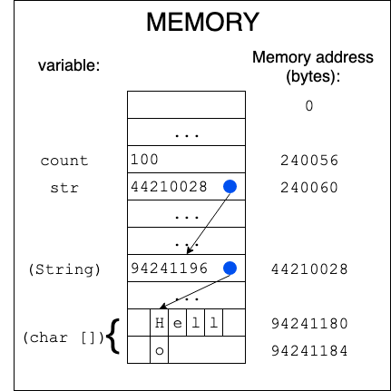
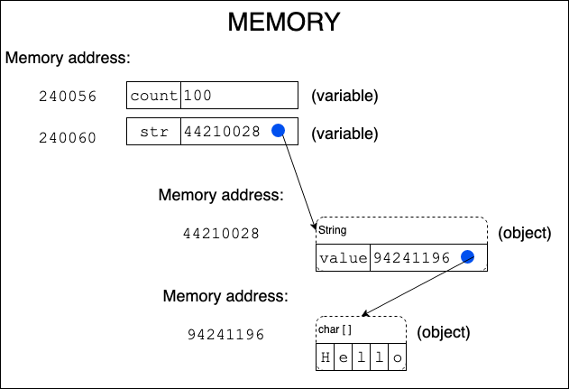

# Intro to Memory

## How does a computer keep track of my program's variables, objects, data? (Memory)

The short answer is: memory! **Memory** is where the computer stores
data that its applications are working with. The main coordinator
running your program is the Central Processing Unit (CPU), which runs
the code that you’ve written. It performs all of the actions you’ve
coded, for example: arithmetic operations, `if`-conditions, `for`-loops.
The CPU itself has space for just a handful of variables at a time, mere
bytes. When it needs to read a variable’s value to perform an operation
on it (for example comparing an `int` to the value `1` for an
`if`-condition), the CPU needs to pull the variable into its storage
(called registers) from memory, which can store far more than the CPU:
gigabytes of data. When the result of the operation is available, the
CPU typically needs to write it back out to memory to be used again
later. A computer’s memory is also called **Random Access Memory
(RAM)**, which means that the CPU can read or write anywhere in RAM at
any time (vs only reading it from beginning to end, for example). When a
program completes, the data stored in memory is freed up to be used by
other applications.

The program specifies a location in memory to read/write from using an
**address** (a specific byte number starting with 0 going up to the
number of bytes in memory). Each variable or object is assigned its own
address in memory. When your code accesses the variable, the CPU reads
or writes its value in RAM via the variable's address.

## How do Java programs work? (JVM)

The **Java Virtual Machine (JVM)** Is a program running your Java
program. The JVM keeps track of which line of code is currently
executing, and manages the memory available to your program. The
"virtual" refers to the fact that the JVM simulates a complete computer
on its own (including executing lines of code, updating/reading memory
etc). The JVM is a software-only simulation of a CPU and RAM instead of
actual hardware, such as the physical CPU and RAM in your computer.

## Java variables

In Java, a **reference** is a variable that is an object type, as
opposed to a primitive type. It is how the JVM locates the object in
memory. The reference is essentially a memory address indicating where
the value is stored in the JVM’s memory. In fact, you may have seen the
reference value if you ever called `toString()` on an object that didn’t
have a custom `toString()` method implemented: for example,
`MemoryExample@14899482` might be the `toString()` value for
`MemoryExample`, the class we’ll be looking at below. The number after
the `@` symbol is the reference. This value is of no value to you as a
developer, so don’t try to read too much into it.

The reference can also be `null`, which means that the reference isn’t
"pointing to" any object at all, as it is not pointing to a valid memory
location. You may sometimes hear someone refer to a variable "pointing
to" an object, or that a variable "is a pointer to" an object. These all
refer to a variable storing a reference to an object in memory.

Below is a diagram showing memory in one large block (with "..."
representing wide spans of memory currently unused). We show two
different variables, one primitive (`count`) and one object reference
(`str`). In memory, the `count` variable contains the number, 100.
`str`, however, is a reference, so the `str` variable in memory contains
the location (44210028) of the `String` object, "Hello", somewhere else
in memory. The dot in the `str` box with an arrow pointing to the
`String` object's location in memory reflects this relationship. Note
that `String` objects contain their own variable, `value`, that points
to the char array object that stores the actual string contents. So
here, `str.value` stores 94341180, the location of the beginning of the
char array storing "Hello". We will stop showing the memory locations in
the diagrams from here, and just show the dots and arrows for a variable
"pointing to" an object.

This is pretty close to how memory is organized, in a long block
starting at 0, and going up to the number of bytes available in RAM.
From now on, we'll show a slightly more stylized representation that will
help us when we talk about how memory is organized in the JVM. Here are
the same variables, memory addresses, and objects--but freeing our
diagram from the strict linearity of RAM.

