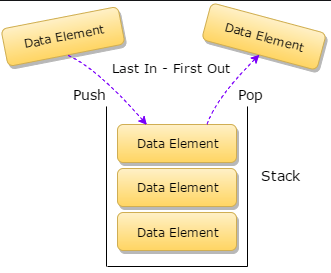
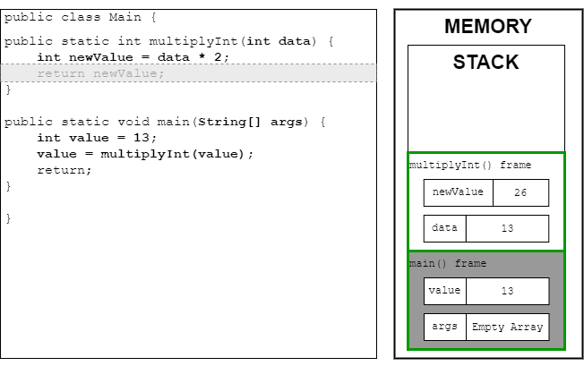
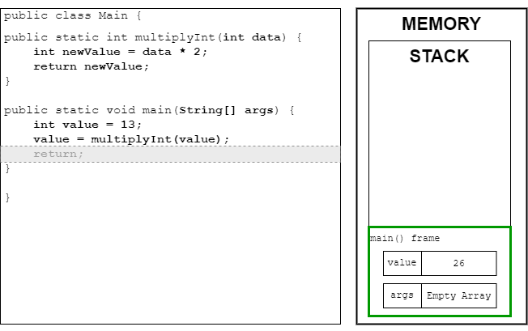
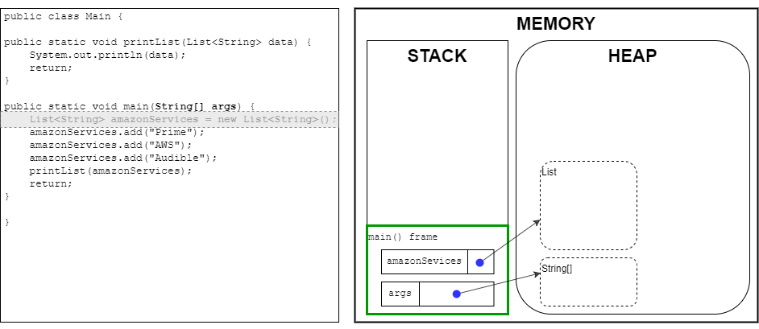
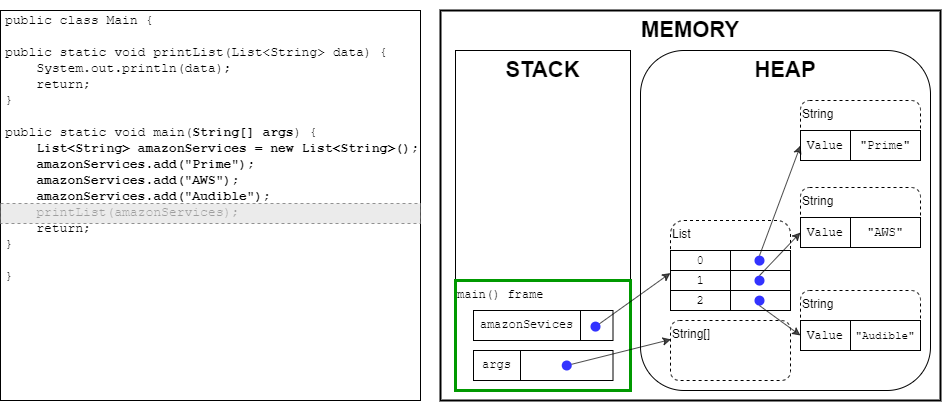
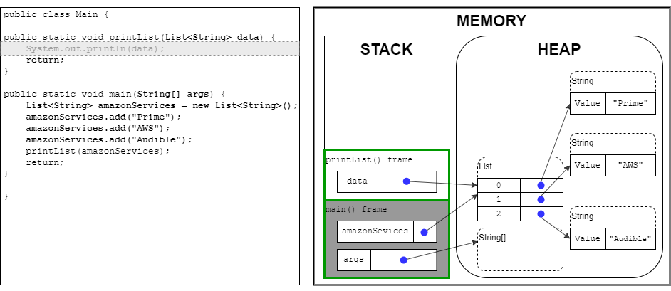
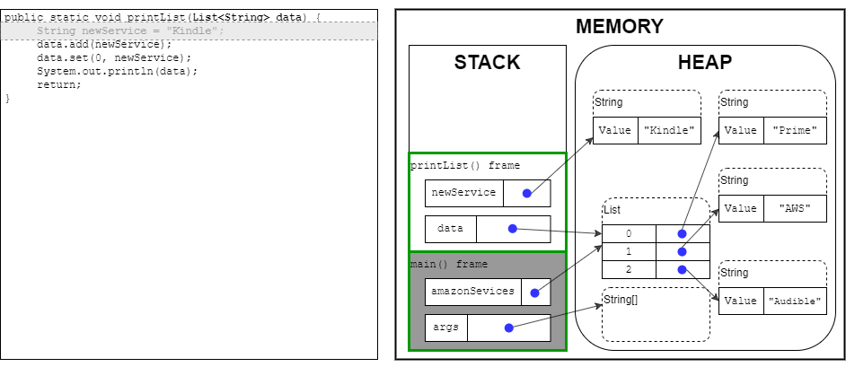
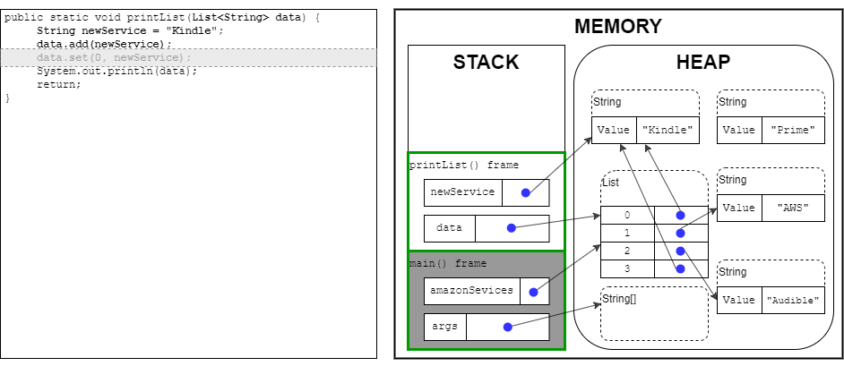

Memory Storage
==============

In this reading, we'll focus on the two sections of Java's memory storage: the stack and the heap. We'll go
step by step over how the stack pushes local variables and frames on top of each other and pops them off as
methods are completed. Then we'll look at how the heap stores objects, and how it works with the stack to
keep things accessible to our programs.

The stack
---------

As we've already covered, memory is where the computer stores data for the programs that are running. In
Java, the memory for a program is organized into two sections, the *stack*, and the *heap*. The stack stores
the local variables for methods that are currently executing in code. The heap stores objects and their member
variables for the whole application. We will focus on the stack first and will cover the heap later in this
reading.

The stack is a "Last In, First Out" data structure, also called LIFO. When a method starts executing, a data
representation of it is added, or "pushed", to the top of the stack. This is called a *frame.* When a new
method is invoked, another frame is added onto the top of the stack, and any previous frames are pushed down.
Only the frame at the top of the stack is active at any given time. When a method has completed execution,
it's removed or "popped" from the top of the stack, and the previous frame is now the active frame. The 
stack works similarly to a stack of dishes to be cleaned. You can add and remove at the top (never from the
middle/bottom).

Below is an illustration of a stack:




This is what we mean by "Last In, First Out". Only the *last* frame added to the stack is active. Any
previous frames must wait until we pop enough frames off to reach them. The *last* frame added is the *first*
frame removed. Each frame stores any local primitive variables for the method, which are added in a similar
manner, by being pushed into the top frame. Each variable can be accessed at any point inside the method after
it's added to the frame. Any objects, or non-primitive variables, created inside the method are added to the
heap, and will have a reference to them inside the frame. We'll be covering this more in-depth later.

Understanding how this works can be hard to follow, so let's look at a visual example. In this code snippet,
we are processing a value in the main method by passing it to a method `multiplyInt()`. All the variables are
local values, so we'll be only be looking at the frames and their contents that are created in the stack.

```java
public class Main {
    public static int multiplyInt(int data) {
        int newValue = data * 2;
        return newValue;
    }

    public static void main(String[] args) {
        int value = 13;
        value = multiplyInt(value);
        return;
    }

}
```


*Figure 1: The code snippet above, with the line `value = multiplyInt(value);` highlighted. Next to it is a
box labeled "Memory" with a sub box labeled "Stack" inside. Inside the stack is a frame labeled `main()`
that contains two variables: "args" which is an empty array and "value" which has the value 13.*

In *Figure 1*, the `main()` method is the first method executed so it's the first frame pushed onto the stack.
On creation the frame is empty, and as we execute the method line by line any new variables created are pushed
on top of the frame. The first variable added is the parameter `String[] args`. The `args` variable is just an
empty `String` array, so there's no data inside it, but the space is still allocated on the stack. In the first
line of the method, `int value` is pushed onto the frame next. The `value` variable is initialized with the `int`
value of 13, which is added to the stack inside the main frame. Both args and value are what is known as "in
scope" to the `main()` method. They can't be accessed by any method outside of `main()`, but inside they can be
accessed at any time while `main()` is currently executing. This means their *scope* is limited to the main
method.

As we hit the next line in the method, `value` then is assigned to the result of the `multiplyInt()` method and
passes in itself as an argument. This is where we leave the scope of `main()`, and a new frame for `multiplyInt()`
is added to the stack.

When `multiplyInt()` is called, a new frame is now created and added to the top of the stack. The frame for
`main()` is no longer at the top of the stack and is considered out of scope. The data is still being stored,
but it can no longer be accessed or modified until it is back at the top of the stack.



*Figure 2: Modified from the last figure, the line `return newValue;` in the code snippet is now highlighted.
In the stack, there's a new frame labeled `multiplyInt()` that contains two variables: `newValue` with a
value of 26 and data with a value of 13. It's on top of the `main()` frame which is now greyed out.*

In *Figure 2*, we've paused execution on `main()` before the method is returned. We can see that the `main()` frame is
at the bottom of the Stack, but still stores the two variables inside it. The new `multiplyInt()` frame contains the
two new local variables in the order that they were created.

The first step of this new frame was to create a new variable `data`. Unlike `args` in `main()`, `data` has an initial
value of 13. This is from `value` being passed into `multiplyInt()`. The `value` variable is local to the `main()`
frame, and that frame is no longer at the top of the stack, so it can't be accessed directly. That is why we
must pass localized data between methods since they cannot read any data outside of their scope.

The next line of code then creates a new local variable, `newValue`, which is initialized with the value of `data`
multiplied by two. `newValue` is added to the frame with a value of 26. We now have two local variables in the
`multiplyInt()` frame, and the next line of code will return the method.

When we hit the line `return newValue;` in the code's execution, the frame doesn't actually get popped off
there, but at the end of the curly bracket. The `return` keyword tells the method to assign the value of
`newValue` to whatever variable was assigned when we invoked `multiplyInt()`. In this case, it would be `value` from the
`main()` method. Once the closing curly bracket is hit, the frame for `multiplyInt()` is popped off, and the frame for
`main()` becomes the active frame again. All data and variables inside the frame for `multiplyInt()` will be popped off
as well once the frame is removed from the stack.



*Figure 3: Modified from the last figure, the line `return;` inside `main()` is now highlighted in the code
snippet. The frame for `multiplyInt()` has been popped off, and the current frame is now `main()`. The `int` inside
the variable `value` now reads 26.*

In *Figure 3*, the variable `value` is then updated with the new value that was returned from `multiplyInt()`. The
`value` variable was overwritten and now reads 26, which was the value calculated inside `multiplyInt()`. Note
that this value only updates once the frame for `multiplyInt()` frame has been popped off the stack, and the
frame for `main()` is at the top of the stack again. The variables inside a frame will not be modified while
it's out of scope and another frame is active. Only when a frame is active again will its variables be
updated with the result of a method call.

After `return;` is executed, Java will reach the ending curly brace for `main()`. Then that frame is popped off
the stack too. Since there's no more code executed, the curly brace for the class is then hit, and the
program terminates.

The heap
--------

While stacks are good for managing local variables and methods, how do we keep track of more complex values
and share them between methods and classes? In the last example, all the variables and data that we created
and calculated were thrown away once the methods were done using them. This was working as intended for the
stack, but what if we want to hang onto the data that we create and modify? This is where the heap comes in.

The heap is the larger portion of Java's memory. This is where most of the memory for our application is
stored. The heap doesn't have any concept of scope, but rather stores things by reference. As long as
something is being referenced, it can be accessed on the heap. While the stack stores local primitives, the
heap stores objects, which contain primitive member variables or references to other objects on the heap.)

Let's look at an example of how the heap works. In the main method below, we have a `List` of type `String`
called `amazonServices` that holds the names of Amazon services. After populating the `List`, it then calls the
method `printList()` which prints the contents of the passed-in list.

```java
public class Main {
    public static void printList(List<String> data) {
        System.out.println(data);
        return;
    }

    public static void main(String[] args) {
        List<String> amazonServices = new List<String>();
        amazonServices.add("Prime");
        amazonServices.add("AWS");
        amazonServices.add("Audible");
        printList(amazonServices);
        return;
    }

}
```

There are fewer steps to go through this time, but there's just as much to cover. In *Figure 4*, we create a
`List` object that will hold the three `String` objects.



*Figure 4: The code snippet above, with the line `List<String>amazonServices = new List<String>();`
highlighted. To the side a box labeled "Memory" has two boxes inside labeled as the stack and the heap. The
stack has a frame labeled `main()` that holds two variables: `amazonServices`, and args. Both these variables
are pointing to objects on the heap, `amazonServices` pointing at an empty `List` object and args pointing at an
empty string array object.*

The first thing to understand in this figure is what data the stack is holding. Because `amazonServices` is a
`List` object, it isn't stored in the stack frame, but on the heap instead. The stack still holds the variable
`amazonServices`, but this data is really a *pointer* to a memory address on the heap where the `List` object is
stored. This gives us a way to access the object sitting on the heap, which we can't access directly in the
stack. We commonly refer to the variable as holding a *reference* to the object. Note that args is shown in
the stack, but this time has an empty `String` array inside the heap. This was also the case last time, but the
actual array wasn't represented since we wanted to focus on the stack.

Not every object that is added to the heap will get a reference inside a stack. In *Figure 5* we show an
example of this as we execute a few more lines and stop before we start executing `printList()`.



*Figure 5: Modified from the last figure, the line "printList(amazonSevices);" is now highlighted in code.
The `List` object on the heap has three new elements now, each one pointing at three new `String` objects:
"Prime", "AWS, and "Audible".*

In our code, we've added three strings to the `List` object. Inside the heap, the `List` object now has three new
elements, and there are three new `String` objects. This is from the `add()` method calls that we just executed.
Each time we added a `String` to the `amazonServices` list, we also created a new `String` object. However, we
didn't assign them a local variable reference in the method, so the only place that those three `String`
objects are referenced is inside the `List` in the heap. What this means is that currently, the only way we can
access the three `String`s we just created is by getting their references from inside the `amazonServices`
variable reference on the stack.

Note that the three objects are not in any certain arrangement inside the heap! Unlike the stack, objects can
be added anywhere inside the heap. This is part of the reason we need a reference to them.

In *Figure 6*, we move on to the `printList()` method, and see what changes have
happened.



*Figure 6: Modified from the last figure, the line `System.out.println(data);` is now highlighted in code.
The Stack has a new frame "`printList()`" that has pushed down the `main()` frame and greyed out. `printList()`
contains a variable `data` that is pointing at the existing `List` object on the heap.*

The frame for `main()` has been moved down the stack and greyed out now that we are in the `printList()` frame. A
local variable data has been created from the parameter just like in the last example, but you'll note that
the variable data now also points towards the `List` inside the heap. As with last time, the method call copies
the data in the parameter into a new variable, but this time the data is just the *pointer address*, not the
object itself. This means that both `main()` and `printList()` currently both have references to the same object!
But as `printList()` is the top frame on the stack, it's the only one that can actively use the reference.

After the list has been printed, Java reaches the end of `printList()` and returns it, popping it off the stack.
The `data` variable is popped off as well, but the `List` object remains. Only the reference to the list that was
stored inside `printList()` has been destroyed. The original reference stored in `amazonServices` is untouched.
Once we exit `printList()` back into `main()`, that method is then returned and ended. `main()` is popped off the
stack, destroying everything and terminating the program.

Passing variables
-----------------

We now know how the stack and heap add and remove variables and data, but let's look at an example where
things can get confusing!

```java
public static void printList(List<String> data) {
    String newService = "Kindle";
    data.add(newService);
    data.set(0, newService);
    System.out.println(data);
    return;
}
```

In this example, we're modifying `printList()` from the last section to the code above. It now modifies
the `List<String>` object that we passed into the method. We create a local `String` variable `newService`, and
not only add it to the end of the `List` but also replace the first element with it. Then it prints the `List` as
normal. Let's look at *Figure 7* to see what's happening behind the scenes.



*Figure 7: Based on the previous diagram, with some modifications. The code box contains the modified
`printList()` code snippet, with the line `String newService = "Kindle";` highlighted. In the `printList()`
frame, there's a new variable `newService` that is pointing to a new `String` object on the heap "Kindle".*

In this first line of code, we create a local string variable `newService`. When we do this, we create a new
`String` object on the heap, and a reference to it on the `printList()` frame on the stack. As we explained
before, objects are only stored on the heap, and primitives and references are stored on the stack.

In the *Figure 8*, we change up some of the elements inside the list:



*Figure 8: Modified from the previous diagram. The code line `data.set(0, newService);` is highlighted. The
`List` object on the heap has a new element pointing at the `String` "Kindle" object. The first element of the
list is also pointing at this object, leaving the original `String` object "Prime" disconnected.*

What we've done here is two things. First, we added a new reference to the `List` object using `newService`. In
the same way that we passed the `List` reference from the `main()` method to `printList()`, we do the same with the
`String` object that `newService` is pointing at. `newService` and the `List` object now both hold the same address to
the `String` containing "Kindle". In the next line, we replace the reference in the first element of the `List`
with `newService` as well, making two references to that object inside the `List`.

This example is to demonstrate that all we've done is add and remove references. These references all point
to the same object inside the heap, the `String` "Kindle". We only created one `String` object and passed the
references around between local variables and other objects. If these were primitive variables on the stack,
we would have been copying the value to multiple variables.

Note that the `String` object "Prime" now isn't referenced by any other object in the heap or any variables
on the stack. This means we no longer have any access to it, and it's eligible for removal or "garbage
collection". We'll discuss this more in a later reading. If we wanted to reuse the `String` value "Prime"
again after this point, we would have to create a whole new `String` object.

Another important thing to remember is that once this method returns, the changes it made to the list will
persist! The objects remain as they are on the heap. This means that the `main()` method will see the changes we
made to the `List` if it accessed the `List` object from the local variable `amazonServices`. You should be aware of
how you're accessing and modifying any objects on the heap! The `printList()` method doesn't specifically
return the object but it still makes changes that could affect the rest of the application.

Conclusion
----------

In this reading, we learned how the stack and heap store data in memory, and how they work with each other so
our programs can access it. We learned how the stack manages its data, by keeping everything currently
executing at the top of the stack. Then we learned how the heap stores data, and the ways in which we must use
the variables accessible to us in the stack to keep references to the heap's data. With this under our belts,
we should now have a deeper understand of how Java manages its memory and can apply that knowledge to future
lessons.
